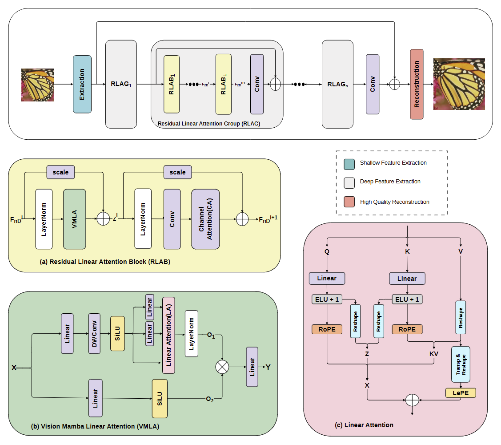
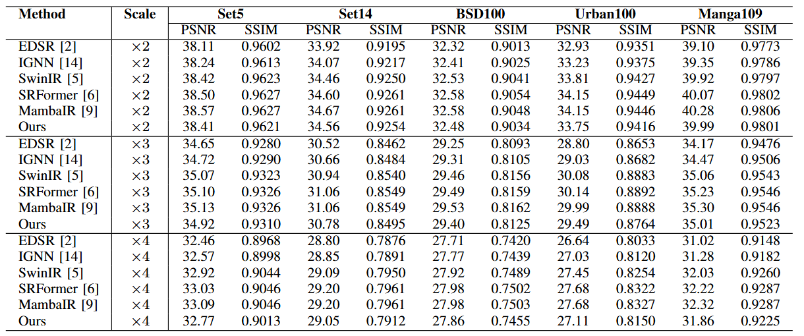
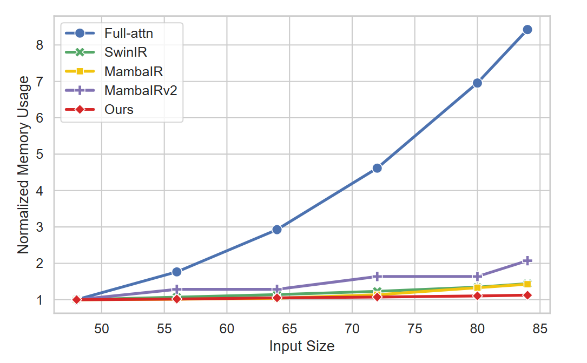
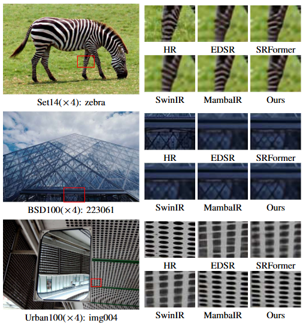

# GLASS: Global Linear Attention for Efficient Single-Image Super-Resolution

> Official PyTorch implementation of **GLASS**
>
> Accepted at **IEEE TENCON 2026**

**Authors**

Sreenath K A* · Nishalini K* · Jiji C V

Department of Computer Science  
Shiv Nadar University Chennai

\* Equal contribution

---

## Overview

GLASS is a novel architecture for single-image super-resolution that combines efficient global linear attention with hierarchical residual feature learning for high-quality image reconstruction.

The proposed architecture introduces three key components:

- Residual Linear Attention Block (RLAB)
- Vision Multi-Level Linear Attention (VMLA)
- Residual Linear Attention Group (RLAG)

These components enable efficient global context modeling with linear computational complexity while preserving local structural information through lightweight convolutional operations and positional encoding.

---

## Architecture

GLASS follows a three-stage super-resolution pipeline consisting of:

1. Shallow Feature Extraction
2. Deep Feature Extraction using stacked Residual Linear Attention Groups
3. High-Quality Image Reconstruction

<p align="center">
    
</p>

---

## Quantitative Results

The proposed GLASS architecture is evaluated on five standard benchmark datasets including Set5, Set14, BSD100, Urban100, and Manga109 for ×2, ×3, and ×4 super-resolution.

<p align="center">
    
</p>

---

## Computational Efficiency

GLASS achieves a lightweight architecture with only **15.44M parameters** while maintaining competitive reconstruction performance and efficient inference.

| Method | Parameters (M) | FLOPs (G) | Latency (ms) | GPU Memory (GB) |
|----------|--------------:|----------:|-------------:|----------------:|
| MambaIR | 20.42 | 135.41 | 89.00 | 0.22 |
| MambaIRv2 | 22.90 | 174.43 | 127.50 | 0.19 |
| **GLASS** | **15.44** | **125.64** | **63.15** | **0.11** |

---

## GPU Memory Scaling

GLASS demonstrates near-linear GPU memory growth with increasing image resolution, enabling scalable inference for high-resolution image restoration.

<p align="left">
    
</p>

---

## Visual Comparison

Qualitative comparisons on benchmark datasets.

<p align="left">
    
</p>

---

## Repository Structure

```text
GLASS
├── assets/
├── basicsr/
├── datasets/
├── experiments/
├── options/
├── scripts/
├── requirements.txt
└── README.md
```

---

## Installation

Clone the repository and install the required dependencies.

```bash
git clone https://github.com/SreenthKA/GLASS.git

cd GLASS

conda create -n glass python=3.10 -y

conda activate glass

pip install -r requirements.txt

python setup.py develop
```

---

## Dataset

Training is performed using the [**DF2K**](https://drive.google.com/file/d/1TubDkirxl4qAWelfOnpwaSKoj3KLAIG4/view?usp=share_link) dataset.

Evaluation is conducted on:
[Test Dataset](https://drive.google.com/file/d/1n-7pmwjP0isZBK7w3tx2y8CTastlABx1/view?usp=sharing)
- Set5
- Set14
- BSD100
- Urban100
- Manga109

Refer to `datasets/README.md` for the expected directory structure.

---

## Training

```bash
# ×2 from scratch
python basicsr/train.py -opt options/train/glass/train_GLASS_SR_x2.yml

# ×3 / ×4 fine-tune from the ×2 checkpoint
# (set path.pretrain_network_g to your GLASS_SR_x2 weights first)
python basicsr/train.py -opt options/train/glass/train_GLASS_SR_x3.yml
python basicsr/train.py -opt options/train/glass/train_GLASS_SR_x4.yml
```

For multi-GPU distributed training, launch with
`torchrun --nproc_per_node=<N> basicsr/train.py -opt <config> --launcher pytorch`.

## Testing

Place the pretrained weights under `experiments/pretrained_models/` (matching
the `pretrain_network_g` paths in the test configs), then:

```bash
python basicsr/test.py -opt options/test/glass/test_GLASS_SR_x2.yml
python basicsr/test.py -opt options/test/glass/test_GLASS_SR_x3.yml
python basicsr/test.py -opt options/test/glass/test_GLASS_SR_x4.yml
```
---

## Pretrained Models

Pretrained checkpoints are available on Google Drive.

**Download:** [Google Drive](https://drive.google.com/drive/folders/1Nr_0W2RvCtzZtcU8OyNGCK28q_e3_BgY?usp=sharing)

Download the checkpoints and place them in:

```text
experiments/pretrained_models/
```
---

## Citation

If you find this work useful in your research, please cite:

```bibtex
@inproceedings{glass2026,
  title={GLASS: Global Linear Attention for Efficient Single-Image Super-Resolution},
  author={K A, Sreenath and K, Nishalini and C V, Jiji},
  booktitle={IEEE Region 10 Conference (TENCON)},
  year={2026}
}
```

---

## Acknowledgements

This repository is built using the BasicSR framework.

---

## License

This project is released under the Apache License 2.0. See the `LICENSE` file for details.
